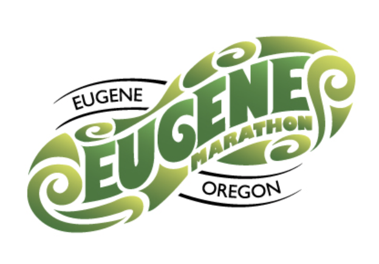

### Eugene Marathon Results Analysis
Analysis of Eugene Marathon data scraped from the results page. Includes Tableau dashboard.  
[Learn more](/Marathon/){: .btn .btn--primary}

### Spotify Prediction Model
Using a massive dataset of 500,000+ songs from Spotify, I built a model that can predict the popularity level of a track based on sonic characteristics.  
[Learn more](/Spotify){: .btn .btn--primary}

### Biome Mirror
A mobile web app that opens your camera and grows a different color forest or biome around you in real time, based on on-device face tracking. Nothing ever leaves your device.  
[Enter the biome](/biome/){: .btn .btn--primary}

### Psychedelic Forest
A 3D Three.js forest of glowing, color-cycling flowers whose palette is seeded from your face and shifts with your expression, so it looks a little different for everyone who looks at it.  
[Enter the forest](/psyforest/){: .btn .btn--primary}

### Driftwheel
An ambient synth pad you play by spinning wheel-style selectors for the root note, chord type, and synth tone, with an arpeggiator that picks out the notes of whatever chord you're holding.  
[Start drifting](/driftwheel/){: .btn .btn--primary}

